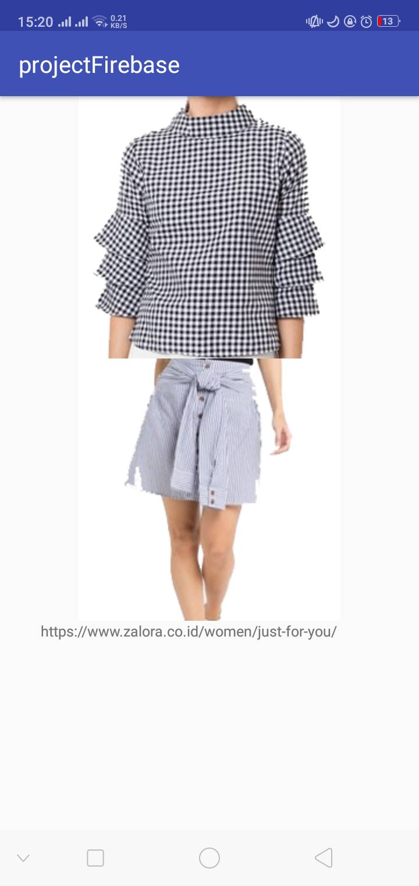

# FirebaseAuth
Berikut adalah tampilan OOTDMatch ...

Login dan Register Firebase, Fragment "OOTDMatch" dan Camera

1. Tampilan Splash Screen "OOTDMatch"

2. Halaman Register

3.a. Halaman Sign In with Email

 

3.b. Halaman Sign In with Google

 

4. Halaman Home OOTDMatch

5. Halaman Fragment OOTDMatch

 

6.a. Halaman Polimoji - Tampilan Awal

 

6.b. Take Picture

6.c. Share Picture

